# **Digital.ai Deploy demo with Ansible**


This a demo setup to demonstrate two simple uses cases of using Ansible with Digital.ai Deploy.

There are two demonstrations:
1. Demo Local demonstrates how to use an existing Ansible machine (the Ansible Controller) to configure a Tomcat server on two existing machines (the Target Machines)

2. Demo AWS demonstrates how to provision machines in AWS:
- deployment 1 creates a new AWS instance and configures Ansible on this new instance (the Ansible Controller)
- deployment 2 creates a new AWS instance (the Taget machine)
- deployment 3 installs Tomcat on the Target machine using the Ansible Controller
- deployment 4 deploys the petClinic-war application on tomcat
---

## Demo local 


### Overview:

The demo architecture is based on 4 machines: 

* The host machine: where Deploy is installed
* Machine 1 called 'Ansible controller machine': where ansible is installed
* Machine 2 called 'Ansible target machine 1': where to apply Ansible playbook and deploy application.
* Machine 3 called 'Ansible target machine 2': same as machine 2.

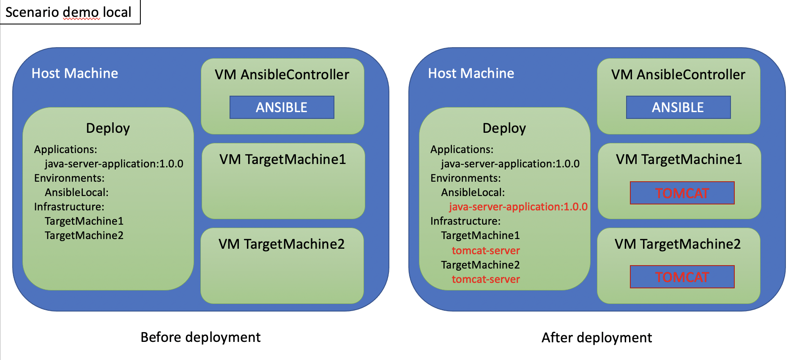


All the machines are configured on the host machine using vagrant.

* Machine 1: fixed IP : 192.168.78.3
* Machine 2: fixed IP : 192.168.78.4
* Machine 3: fixed IP : 192.168.78.5

If you want to change the IP address edit both the 'machines/Vagrantfile' and 'gitops/Infrastructure.yaml'

## Configuration steps before running the demo

## Step 1/5 : Change the key paths
Change the absolute path to the keys, in the file 'gitops/Infrastructure.yaml'

If you want to generate new keys run the following command and change the file 'gitops/Infrastructure.yaml' and the file 'machines/Vagranfile'

```
ssh-keygen
```


## Step 2/5 : Start the machines
In the machines folder run the command:
```
vagrant up
```
to create and start the 3 machines.
It may take a few minutes.


## Step 3/5 : Check or Change the Deploy URL
In the file 'gitops/Infrastructure.yaml', change the value for the key 'devopsAsCodeUrl'.
It's the URL to the local Deploy server. Default value is "http://localhost:4516"

## Step 4/5 : import items in Deploy
In the gitops folder run the command:
```
xl apply xl-deploy -f AnsibleDemo.yaml
```

## Step 5/5: start a deployment

Deploy the app 'Applications/AnsibleDemo/java-server-application/1.0.0' in the environment 'AnsibleDemo/Local/AnsibleLocal'


## During the demo
---
The default deployment does not use any orchestrator. All the tasks are executed sequentially.

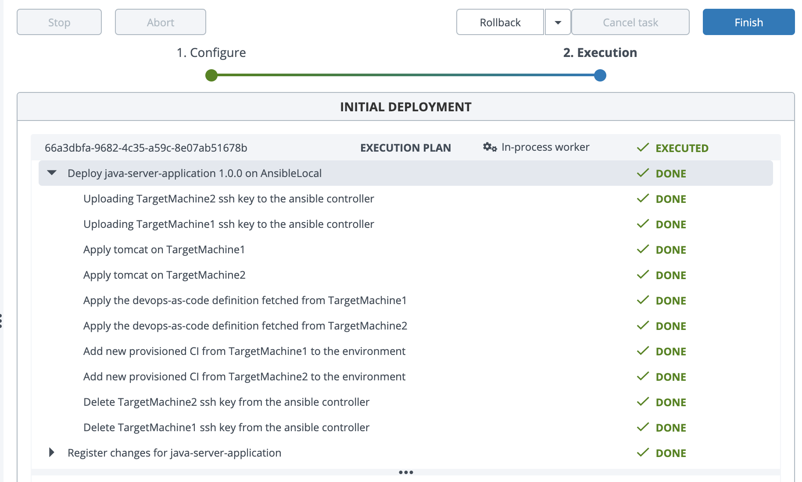

To demonstrate one of the value of Deploy, undeploy the app and do a second deployment with the orchestrator 'parallel-by-container'. Now the provisonning for each machine is done in parallel!

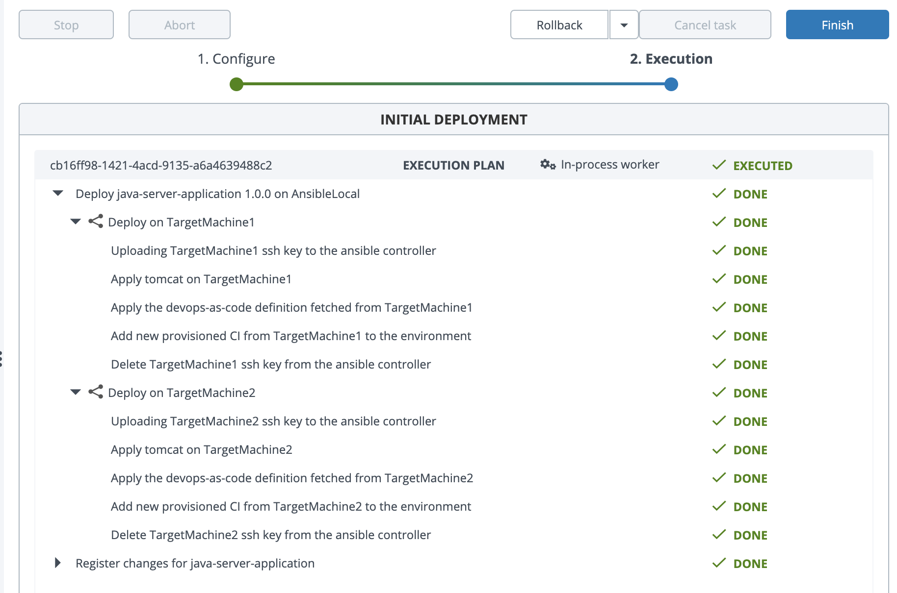

---
## AWS Demo. Configuration steps before running deployments

## Step 1: install the ec2-keypair-plugin in Deploy

See the folder aws.


## Step 2: set the connection for your AWS account


Change the 'Secret Key ID' and 'Secret Access Key' to access AWS.

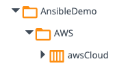

## Step 3:  Change the dictionary values

Change the values for the keys 'aws_ami', 'aws_instance_type' and 'aws_region' that may vary depending of the AWS region you want to use. 

Change the values for the keys 'key_pair_path' and 'key_pair_path_tomcat': these paths are used locally to generate new keys for the new AWS instances. You may have to change the path depending of your operating system.

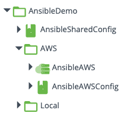


---

## During the demo

## Step1: deploy the application 'ansible-controller' to the 'AnsibleAWS' env.

Expected Result: a new AWS instance is created, configured with Ansible, and a new configuration item has been created in Deploy for the instance.

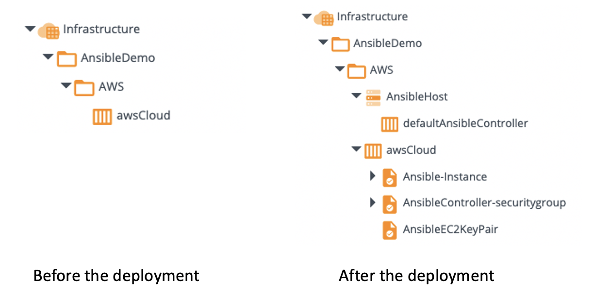

You can check the connection to your new host 'AnsibleHost'

## Step 2: deploy the application 'aws-host' to the 'AnsibleAWS' env.

Expected result: a new AWS instance is created and a new configuration item has been created in Deploy for the instance.

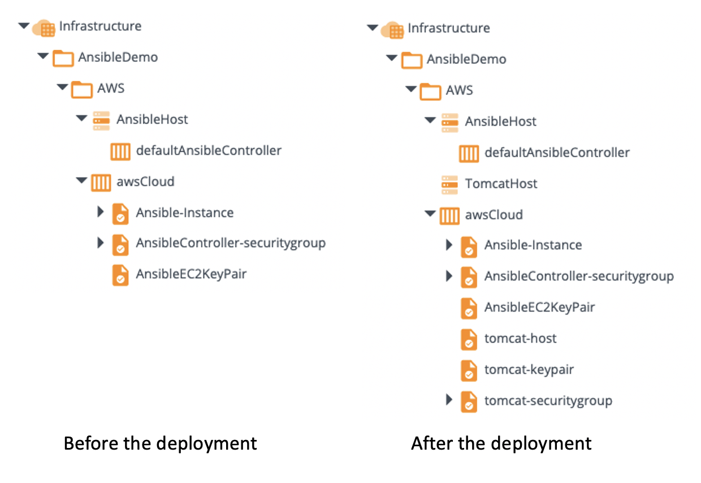

You can check the connection to the new instance 'TomcatHost'.


## Step 3 : deploy the application 'tomcat-server' to the 'AnsibleAWS' env.

Expected result: tomcat has been configured on the machine created in step 2 using the ansible machine created in step 1.

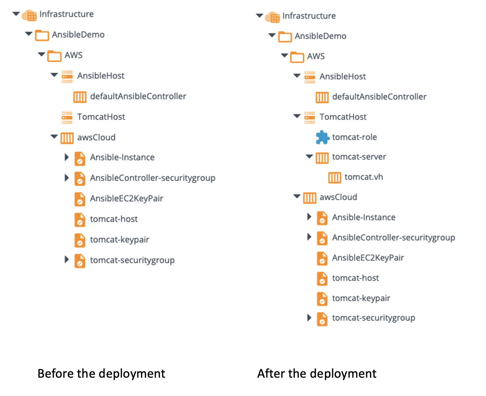

## Step 4 : Import and deploy the 'PetClinic-war' application to the 'AnsibleAWS' env.

Right-click on 'Applications' and choose 'Import from XL Deploy Server'. Choose "PetClinic-war" app.

Expected Result: PetClinic-war app is deployed.
Check port 8080 on your AWS Instance


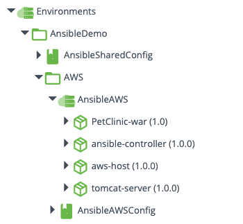
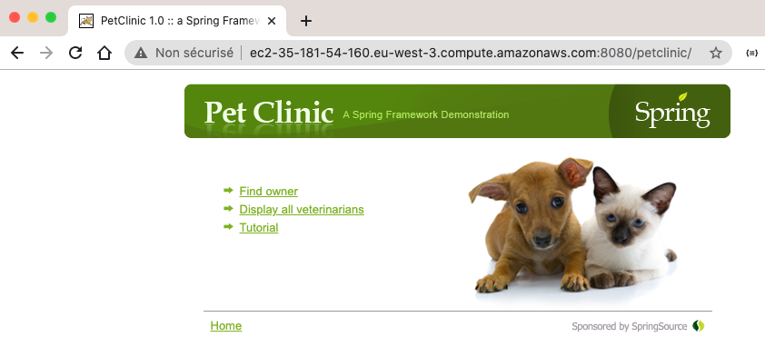

## Step 5 : Use Release

you can use Release to orchestrate all the deployment.

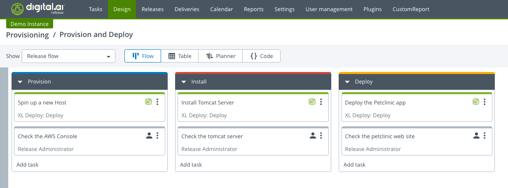

## Step 6 : Undeploy

Do not forget to undeploy all your applications to remove all the AWS instances. (you can use a new Release template)

---
